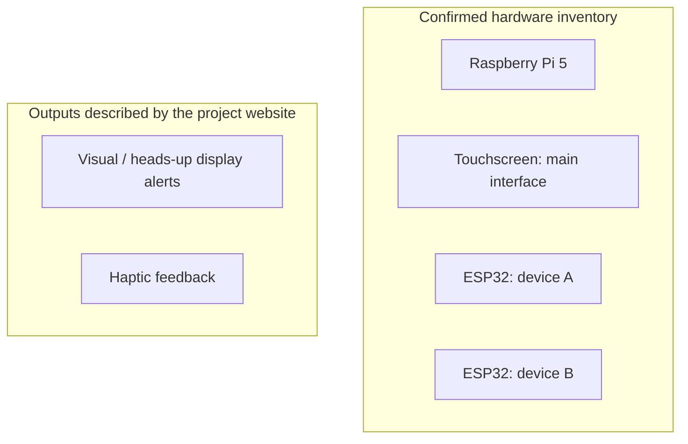

# DriveNAV

DriveNAV is a Mississippi State University senior design project exploring assistive driving technology for people who are deaf or hard of hearing. The project combines visual and haptic alerts to improve awareness of surrounding sounds, particularly emergency vehicle sounds.

## Hardware

- Raspberry Pi 5 running the main touchscreen interface
- Two ESP32 microcontrollers
- Touchscreen for the main interface
- Visual/heads-up display and haptic feedback subsystems described by the project website

The specific duties of each ESP32, communication links, sensor models, pin assignments, and power connections still need documentation. This repository does not assume those implementation details.

## Repository status

This is a project case study. The supplied archive contains a saved Wix website and media assets; it does not contain the Raspberry Pi application or ESP32 firmware. There are currently no runnable device setup instructions or independently verified performance results in this repository.

## Hardware overview



This diagram groups known components; it does not specify electrical connections or communication paths. See [hardware documentation](docs/hardware.md) for details still to capture.

## My contribution

Yusuf A. Sarigul served as project manager, as identified on the project website. A detailed account of personally implemented components, integration work, and verification results should be added alongside source code or supporting artifacts.

## Team

- John H. Thomas — team lead
- Yusuf A. Sarigul — project manager
- Logan Flowers — navigation subsystem
- Noah Rutherford — monitoring subsystem
- Tyler Cresap — HUD subsystem

Roles above are drawn from the archived project website.

## Suggested next improvements

1. Document the actual hardware architecture: both ESP32 roles, Raspberry Pi services, communication protocol, wiring, and power requirements.
2. Show device connection and stale-data status on the touchscreen. Define the behavior when either ESP32 stops responding.
3. Give alerts explicit priority and expiration rules to prevent old or overlapping events from producing misleading feedback.
4. Add a recorded-input or simulated-event demo that runs without the physical hardware.
5. Measure end-to-end alert latency, detection misses, and false alerts under documented conditions. Publish observed results rather than assumed performance.
6. Document startup, shutdown, reconnection, and recovery behavior for all three devices.

These are proposed improvements, not claims about features missing from the original implementation.

See the [completion checklist](docs/completion-checklist.md) for a small, practical path to adding implementation evidence.

## Planned source layout

Once the original code is available, a possible layout is:

```text
pi/                 Main application and touchscreen interface
firmware/esp32-a/   Firmware for the first ESP32
firmware/esp32-b/   Firmware for the second ESP32
docs/               Architecture, wiring, setup, and contribution notes
demo/               Recorded inputs or simulated events
tests/              Protocol and integration checks
```

## Project website

[Original DriveNAV project website](https://yas272.wixsite.com/drivenav-1)

This case study describes an engineering prototype. No validated on-road performance claims are made.
